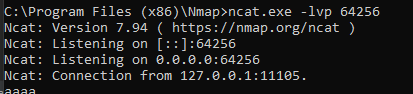
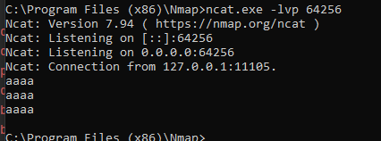
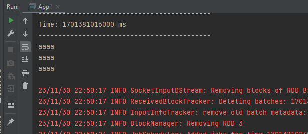

First thing is to start the netcat server with (ncat.exe -lvp 64256)

<h5>Application 1</h5>

display the data received from the server in the console

<h5>Application 2</h5>

Words count

<h3>Activite pratique</h3>

1. Afficher d’une manière continue le nombre d’incidents par service.

